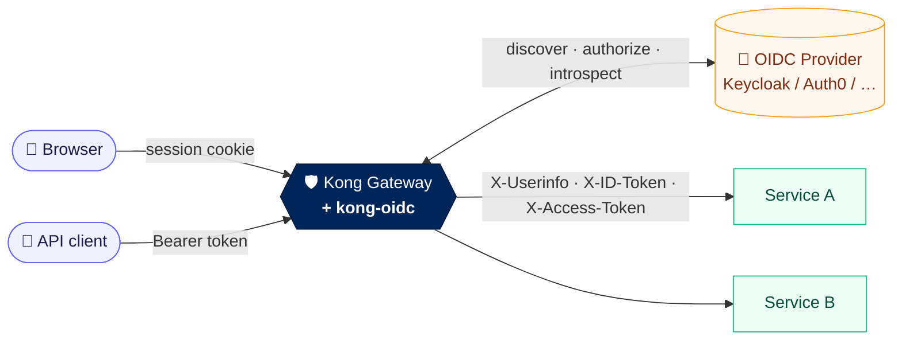
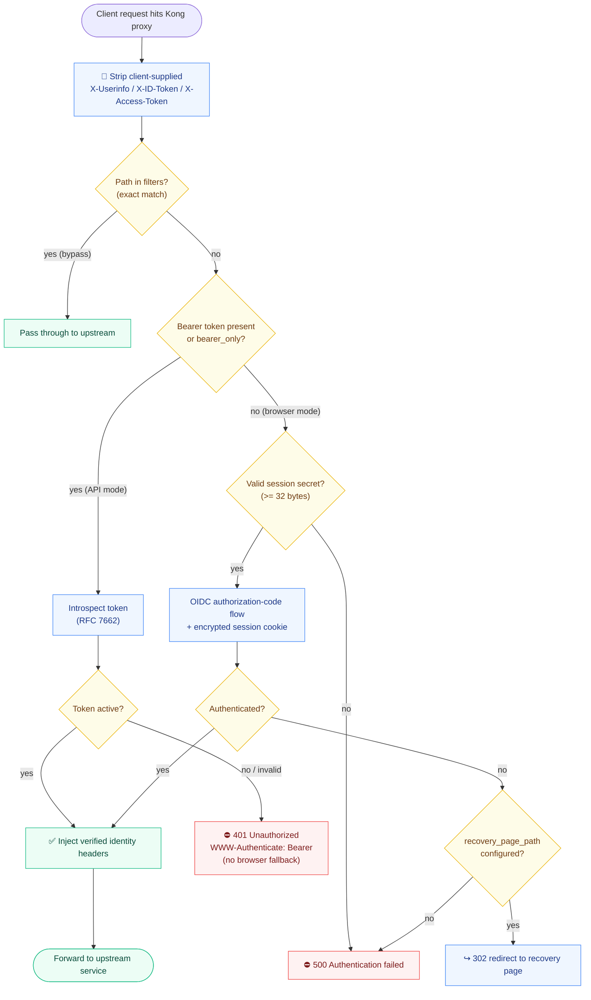

# kong-oidc

> **Drop-in OpenID Connect & token introspection for Kong Gateway 3.x** — turn any
> upstream service into an authenticated one without touching its code.

[](https://github.com/davidgrldo/kong-oidc/actions/workflows/ci.yml)
[](https://konghq.com/)
[](https://github.com/zmartzone/lua-resty-openidc)
[](https://luarocks.org/modules/davidgrldo/kong-oidc)
[](LICENSE)

Kong sits in front of your services and **kong-oidc** makes it the identity
checkpoint: browser traffic goes through the OIDC authorization-code flow, API
traffic is validated by RFC 7662 token introspection, and only a **verified,
un-spoofable** identity is forwarded upstream.



## Why use it

- 🔐 **Two auth modes, one plugin** — interactive browser login *and* machine-to-machine bearer tokens.
- 🚫 **Fail-closed by design** — an invalid bearer token gets `401`, never a silent browser redirect loop.
- 🧱 **Anti-spoofing trust boundary** — client-supplied identity headers are stripped before anything else runs.
- 📌 **Reproducible builds** — Kong image, base rock, and dependency all pinned to a digest/checksum.
- ✅ **Tested three ways** — unit, schema-contract (`kong config parse`), and a full container smoke test in CI.

## How it works

Every request routed through the plugin runs the Kong `access` phase below. The
plugin first strips any client-supplied identity headers (trust boundary), then
either validates a bearer token by introspection or runs the browser
authorization-code flow. Green paths inject a verified identity upstream; red
paths reject the request.



## Compatibility

| Kong | Plugin | lua-resty-openidc |
|------|--------|-------------------|
| OSS `3.9.3` | `2.0.0` | `1.8.0-1` |

The supported baseline is exactly **Kong OSS 3.9.3**. It is the open-source
build distributed by the Kong community, not a vendor-backed LTS release. Do not
configure it against a proprietary/Enterprise-only gateway image.

Plugin version `2.0.0` intentionally breaks configuration compatibility with the
1.x line (see [Upgrading](#upgrading)).

## Installation

### Docker (recommended)

The included `Dockerfile` builds a reproducible image on `kong:3.9.3` that
installs the plugin from a local checkout with `luarocks make`:

```sh
docker build -t kong-oidc:2.0.0 .
docker run --rm kong-oidc:2.0.0 kong version      # 3.9.3
docker run --rm kong-oidc:2.0.0 luarocks show kong-oidc   # 2.0.0-1
```

### LuaRocks (local checkout)

The most reliable install is from a local checkout:

```sh
cd plugins/oidc
luarocks make kong-oidc-2.0.0-1.rockspec
```

### LuaRocks (published rock)

The rock is published under the `davidgrldo` namespace (the root `kong-oidc` name
is held by the upstream Nokia project). Do **not** use `luarocks install
davidgrldo/kong-oidc` directly — LuaRocks `3.12.2` (shipped in `kong:3.9.3`) has a
[namespace-write bug](https://github.com/luarocks/luarocks/issues) that crashes on
namespaced installs. Download the rock and install it by file path instead, which
bypasses namespace resolution:

```sh
luarocks download davidgrldo/kong-oidc 2.0.0-1
luarocks install ./kong-oidc-2.0.0-1.src.rock
```

Then set `KONG_PLUGINS=bundled,oidc` (or `plugins = bundled, oidc` in `kong.conf`)
so Kong loads the plugin.

## Configuration

All options live under the plugin's `config` record.

| Field | Type | Default | Description |
|-------|------|---------|-------------|
| `client_id` | string | *required* | OAuth/OIDC client id. |
| `client_secret` | string | *required* | OAuth/OIDC client secret. |
| `discovery` | string | *required* | Issuer `.well-known/openid-configuration` URL. Must be HTTPS unless `allow_insecure_http` is set. |
| `introspection_endpoint` | string | *(none)* | RFC 7662 introspection endpoint. Required when `bearer_only` is true. |
| `timeout` | number | *(none)* | HTTP timeout in **milliseconds** for OIDC calls (passed to `lua-resty-http` `set_timeout`). |
| `introspection_endpoint_auth_method` | one_of | `client_secret_basic` | `client_secret_basic` or `client_secret_post`. |
| `token_endpoint_auth_method` | one_of | `client_secret_post` | `client_secret_basic`, `client_secret_post`, or `client_secret_jwt`. |
| `bearer_only` | boolean | `false` | When true, only bearer-token introspection is used (no browser flow). |
| `introspection_cache_ttl` | number | `0` | Seconds to cache active introspection results (see [Introspection caching](#introspection-caching)). `0` disables caching. |
| `realm` | string | `kong` | Realm sent in `WWW-Authenticate` on `401`. |
| `redirect_uri` | string | *(none)* | Authorization-code callback path. Required for browser mode. |
| `scope` | string | `openid` | OIDC scopes requested. |
| `response_type` | string | `code` | Authorization response type. |
| `ssl_verify` | boolean | `true` | Verify TLS on OIDC calls. |
| `allow_insecure_http` | boolean | `false` | Permit `http://` endpoints. Local development only. |
| `session_secret` | string | *(none)* | Base64 secret for browser sessions. Required for browser mode. |
| `recovery_page_path` | string | *(none)* | Path to redirect to on auth failure instead of `500`. |
| `logout_path` | string | `/logout` | Path that ends the browser session. |
| `redirect_after_logout_uri` | string | `/` | Post-logout redirect target. |
| `filters` | array | `[]` | Exact absolute paths to bypass authentication. |

### Modes

- **Browser flow** (`bearer_only=false`, the default): unauthenticated requests
  are redirected through the authorization-code flow. Requires `redirect_uri`
  and a `session_secret`.
- **Bearer/API flow** (`bearer_only=true`): every request must present a valid
  `Authorization: Bearer <token>` header, validated by introspection. An invalid
  or missing bearer token returns `401` **without** a browser fallback.

Note that even in browser mode, any request carrying an `Authorization: Bearer`
header is routed to introspection (never to the browser flow). If
`introspection_endpoint` is not configured and the issuer's discovery document
does not publish one, such requests always fail with `401` — configure
`introspection_endpoint` explicitly if mixed traffic is expected.

## Introspection caching

By default (`introspection_cache_ttl=0`), **every** bearer request triggers one
introspection round-trip to the provider. Under high API traffic that makes the
provider a bottleneck and a single point of failure.

Set `introspection_cache_ttl` to a positive number of seconds to cache active
introspection results in Kong's shared cache (`kong.cache`, no `lua_shared_dict`
setup needed). The cache entry's lifetime is the token's own `exp`, capped by
`introspection_cache_ttl`; failed or inactive tokens are never cached.

```yaml
config:
  bearer_only: true
  introspection_endpoint: https://issuer/introspect
  introspection_cache_ttl: 30   # trust an introspection result for up to 30s
```

**Security trade-off:** a token revoked at the provider is still honored from
cache until its entry expires, so a revoked token can remain valid for up to
`introspection_cache_ttl` seconds. Pick the smallest value that gives you the
throughput you need. For JWT access tokens, local signature verification (a
future `validation: jwt` mode) will avoid the round-trip entirely.

## Security

- **TLS verification is enabled by default** (`ssl_verify=true`). Disable it only
  when an intermediary terminates TLS and you understand the risk.
- `allow_insecure_http` permits plaintext `http://` OIDC endpoints. It exists for
  local development only and must never be enabled in production.
- The Kong Admin API **must remain on a private management network**. The default
  Compose stack binds Admin ports to loopback (`127.0.0.1:8001`/`8444`).
- Invalid bearer credentials return `401` and never fall back to a browser
  redirect, so a leaked/unknown token cannot trigger an interactive login loop.

## Session secret

Browser mode encrypts session cookies with `session_secret`. Generate a strong
secret:

```sh
openssl rand -base64 32
```

The value must be valid base64 that decodes to **at least 32 bytes**. Shorter or
malformed secrets are rejected by the schema. Never commit a real secret; supply
it via environment or a secrets manager.

## Identity headers

On a successful authentication the plugin strips any client-supplied
`X-Userinfo`, `X-ID-Token`, and `X-Access-Token` headers **before** processing,
then sets them itself from the verified identity. This prevents a caller from
forging identity headers to reach upstream services. The injected headers are:

- `X-Userinfo` — base64-encoded JSON of the authenticated user claims.
- `X-ID-Token` — base64-encoded JSON of the ID token (browser flow).
- `X-Access-Token` — the verified access token.

The identity is also recorded as the Kong credential via
`kong.client.authenticate`, so credential-aware plugins work — e.g. Rate
Limiting with `limit_by: credential`. The plugin does **not** yet map the
identity to a Kong **Consumer** entity, so consumer-scoped features (ACL,
`limit_by: consumer`, per-consumer plugin config) will not see it. Consumer
mapping is a candidate for a future release.

## Filters

`filters` is an array of **exact absolute paths** that bypass authentication.
Matching is a strict string equality, not a prefix or Lua pattern:

```yaml
filters: ["/health", "/metrics"]
```

- `/health` is skipped; `/health-admin` is **not** (no prefix match).
- Entries must be non-empty and start with `/`.

## DB-less

The default `docker-compose.yml` runs Kong in DB-less mode
(`KONG_DATABASE=off`) with a declarative config mounted from
`config/kong.yml`. This is the simplest reproducible deployment:

```sh
docker compose up
```

Edit `config/kong.yml` — uncomment the example service and fill in your issuer
and client values — then restart. The Admin API is reachable only on loopback.

## PostgreSQL

For a database-backed deployment, run Kong with `KONG_DATABASE=postgres` and a
Postgres server you manage. A minimal start:

```sh
docker run -d --name kong-db \
  -e POSTGRES_USER=kong -e POSTGRES_DB=kong \
  -e POSTGRES_PASSWORD=<strong-password> postgres:16

docker run --rm --link kong-db:kong-db \
  -e KONG_DATABASE=postgres -e KONG_PG_HOST=kong-db \
  -e KONG_PG_PASSWORD=<strong-password> \
  kong-oidc:2.0.0 kong migrations bootstrap

docker run -d --name kong --link kong-db:kong-db \
  -p 8000:8000 -p 8443:8443 \
  -e KONG_DATABASE=postgres -e KONG_PG_HOST=kong-db \
  -e KONG_PG_PASSWORD=<strong-password> \
  -e KONG_ADMIN_LISTEN=127.0.0.1:8001 \
  kong-oidc:2.0.0
```

Never expose the Admin API on a public interface. Keep it on a private
management network and bind it to loopback where possible.

## Troubleshooting

- **`401 Unauthorized` with `WWW-Authenticate: Bearer`** — the bearer token was
  absent, expired, or rejected by introspection. Check the introspection endpoint
  and that the token is still active.
- **`500 Authentication failed`** — a browser-flow error. The raw provider error
  is written to the Kong error log (`KONG_PROXY_ERROR_LOG`); the response body is
  intentionally generic to avoid leaking provider details. Set
  `recovery_page_path` to redirect instead.
- **Schema rejects `session_secret`** — ensure it decodes to >= 32 bytes
  (`echo -n '<value>' | base64 -d | wc -c`).
- **`OIDC endpoints must use HTTPS`** — endpoints are `http://`. Only acceptable
  with `allow_insecure_http=true`, for local dev.

Run the test suite to isolate behavior:

```sh
sh scripts/contract-test.sh      # Kong schema/contract checks
sh scripts/smoke-test.sh         # full container build + DB-less smoke
sh scripts/integration-test.sh   # end-to-end bearer/API auth against a real Keycloak
sh scripts/browser-test.sh       # end-to-end browser auth-code flow against a real Keycloak
```

Both end-to-end tests stand up a real Keycloak issuer, an echo upstream, and
Kong running the plugin. They need Docker and take a minute or two while
Keycloak boots.

- **`integration-test.sh`** proves the bearer/API path: a valid token yields
  `200` with an injected, verified `X-Userinfo`; a forged client `X-Userinfo`
  is stripped; and invalid or missing tokens return `401`.
- **`browser-test.sh`** drives the authorization-code flow with a headless
  Chromium (Playwright): an unauthenticated request is redirected to the
  Keycloak login, a successful login lands back on the app with a verified
  identity and an encrypted session cookie, the session is reused without
  re-login, and `logout` clears it.

## Upgrading

From 1.x to 2.0.0:

1. **String booleans → booleans.** `ssl_verify: "no"` becomes `ssl_verify: false`.
2. **`redirect_uri_path` → `redirect_uri`.** The redirect path is now `redirect_uri`.
3. **CSV filters → array.** `filters: "/health,/metrics"` becomes `filters: ["/health", "/metrics"]`.
4. **Set a strong `session_secret`.** Browser mode now requires a base64 secret
   of at least 32 decoded bytes (`openssl rand -base64 32`).

Kong 2.x plugin definitions are not loadable on Kong 3.9.3; the schema and
handler are Kong 3.x modules.

## License

Apache-2.0. This project is a modified fork of Nokia's
[`kong-oidc`](https://github.com/nokia/kong-oidc); upstream attribution is
retained in `LICENSE`.
