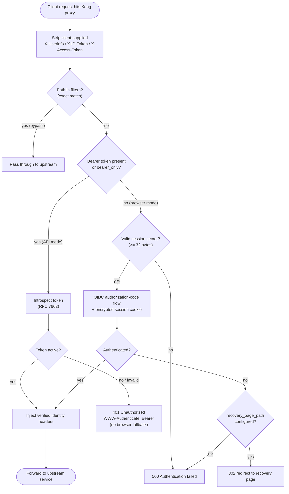

# kong-oidc

OpenID Connect and token introspection plugin for Kong Gateway. Authenticates
browser sessions via the authorization code flow and validates bearer tokens via
RFC 7662 introspection, then injects the caller identity into upstream requests.

This is a modified Apache-2.0 fork of the Nokia [`kong-oidc`](https://github.com/nokia/kong-oidc)
plugin, modernized for Kong 3.x.

## How it works

Every request routed through the plugin runs the Kong `access` phase below. The
plugin first strips any client-supplied identity headers (trust boundary), then
either validates a bearer token by introspection or runs the browser
authorization-code flow.



## Compatibility

| Kong | Plugin | lua-resty-openidc |
|------|--------|-------------------|
| OSS `3.9.3` | `2.0.0` | `1.8.0-1` |

The supported baseline is exactly **Kong OSS 3.9.3**. It is the open-source
build distributed by the Kong community, not a vendor-backed LTS release. Do not
configure it against a proprietary/Enterprise-only gateway image.

Plugin version `2.0.0` intentionally breaks configuration compatibility with the
1.x line (see [Upgrading](#upgrading)).

## Installation

### Docker (recommended)

The included `Dockerfile` builds a reproducible image on `kong:3.9.3` that
installs the plugin from its LuaRock:

```sh
docker build -t kong-oidc:2.0.0 .
docker run --rm kong-oidc:2.0.0 kong version      # 3.9.3
docker run --rm kong-oidc:2.0.0 luarocks show kong-oidc   # 2.0.0-1
```

### LuaRocks

```sh
cd plugins/oidc
luarocks make kong-oidc-2.0.0-1.rockspec
```

Then set `KONG_PLUGINS=bundled,oidc` (or `plugins = bundled, oidc` in `kong.conf`)
so Kong loads the plugin.

## Configuration

All options live under the plugin's `config` record.

| Field | Type | Default | Description |
|-------|------|---------|-------------|
| `client_id` | string | *required* | OAuth/OIDC client id. |
| `client_secret` | string | *required* | OAuth/OIDC client secret. |
| `discovery` | string | *required* | Issuer `.well-known/openid-configuration` URL. Must be HTTPS unless `allow_insecure_http` is set. |
| `introspection_endpoint` | string | *(none)* | RFC 7662 introspection endpoint. Required when `bearer_only` is true. |
| `timeout` | number | *(none)* | HTTP timeout (seconds) for OIDC calls. |
| `introspection_endpoint_auth_method` | one_of | `client_secret_basic` | `client_secret_basic` or `client_secret_post`. |
| `token_endpoint_auth_method` | one_of | `client_secret_post` | `client_secret_basic`, `client_secret_post`, or `client_secret_jwt`. |
| `bearer_only` | boolean | `false` | When true, only bearer-token introspection is used (no browser flow). |
| `realm` | string | `kong` | Realm sent in `WWW-Authenticate` on `401`. |
| `redirect_uri` | string | *(none)* | Authorization-code callback path. Required for browser mode. |
| `scope` | string | `openid` | OIDC scopes requested. |
| `response_type` | string | `code` | Authorization response type. |
| `ssl_verify` | boolean | `true` | Verify TLS on OIDC calls. |
| `allow_insecure_http` | boolean | `false` | Permit `http://` endpoints. Local development only. |
| `session_secret` | string | *(none)* | Base64 secret for browser sessions. Required for browser mode. |
| `recovery_page_path` | string | *(none)* | Path to redirect to on auth failure instead of `500`. |
| `logout_path` | string | `/logout` | Path that ends the browser session. |
| `redirect_after_logout_uri` | string | `/` | Post-logout redirect target. |
| `filters` | array | `[]` | Exact absolute paths to bypass authentication. |

### Modes

- **Browser flow** (`bearer_only=false`, the default): unauthenticated requests
  are redirected through the authorization-code flow. Requires `redirect_uri`
  and a `session_secret`.
- **Bearer/API flow** (`bearer_only=true`): every request must present a valid
  `Authorization: Bearer <token>` header, validated by introspection. An invalid
  or missing bearer token returns `401` **without** a browser fallback.

## Security

- **TLS verification is enabled by default** (`ssl_verify=true`). Disable it only
  when an intermediary terminates TLS and you understand the risk.
- `allow_insecure_http` permits plaintext `http://` OIDC endpoints. It exists for
  local development only and must never be enabled in production.
- The Kong Admin API **must remain on a private management network**. The default
  Compose stack binds Admin ports to loopback (`127.0.0.1:8001`/`8444`).
- Invalid bearer credentials return `401` and never fall back to a browser
  redirect, so a leaked/unknown token cannot trigger an interactive login loop.

## Session secret

Browser mode encrypts session cookies with `session_secret`. Generate a strong
secret:

```sh
openssl rand -base64 32
```

The value must be valid base64 that decodes to **at least 32 bytes**. Shorter or
malformed secrets are rejected by the schema. Never commit a real secret; supply
it via environment or a secrets manager.

## Identity headers

On a successful authentication the plugin strips any client-supplied
`X-Userinfo`, `X-ID-Token`, and `X-Access-Token` headers **before** processing,
then sets them itself from the verified identity. This prevents a caller from
forging identity headers to reach upstream services. The injected headers are:

- `X-Userinfo` — base64-encoded JSON of the authenticated user claims.
- `X-ID-Token` — base64-encoded JSON of the ID token (browser flow).
- `X-Access-Token` — the verified access token.

## Filters

`filters` is an array of **exact absolute paths** that bypass authentication.
Matching is a strict string equality, not a prefix or Lua pattern:

```yaml
filters: ["/health", "/metrics"]
```

- `/health` is skipped; `/health-admin` is **not** (no prefix match).
- Entries must be non-empty and start with `/`.

## DB-less

The default `docker-compose.yml` runs Kong in DB-less mode
(`KONG_DATABASE=off`) with a declarative config mounted from
`config/kong.yml`. This is the simplest reproducible deployment:

```sh
docker compose up
```

Edit `config/kong.yml` — uncomment the example service and fill in your issuer
and client values — then restart. The Admin API is reachable only on loopback.

## PostgreSQL

For a database-backed deployment, run Kong with `KONG_DATABASE=postgres` and a
Postgres server you manage. A minimal start:

```sh
docker run -d --name kong-db \
  -e POSTGRES_USER=kong -e POSTGRES_DB=kong \
  -e POSTGRES_PASSWORD=<strong-password> postgres:16

docker run --rm --link kong-db:kong-db \
  -e KONG_DATABASE=postgres -e KONG_PG_HOST=kong-db \
  -e KONG_PG_PASSWORD=<strong-password> \
  kong-oidc:2.0.0 kong migrations bootstrap

docker run -d --name kong --link kong-db:kong-db \
  -p 8000:8000 -p 8443:8443 \
  -e KONG_DATABASE=postgres -e KONG_PG_HOST=kong-db \
  -e KONG_PG_PASSWORD=<strong-password> \
  -e KONG_ADMIN_LISTEN=127.0.0.1:8001 \
  kong-oidc:2.0.0
```

Never expose the Admin API on a public interface. Keep it on a private
management network and bind it to loopback where possible.

## Troubleshooting

- **`401 Unauthorized` with `WWW-Authenticate: Bearer`** — the bearer token was
  absent, expired, or rejected by introspection. Check the introspection endpoint
  and that the token is still active.
- **`500 Authentication failed`** — a browser-flow error. The raw provider error
  is written to the Kong error log (`KONG_PROXY_ERROR_LOG`); the response body is
  intentionally generic to avoid leaking provider details. Set
  `recovery_page_path` to redirect instead.
- **Schema rejects `session_secret`** — ensure it decodes to >= 32 bytes
  (`echo -n '<value>' | base64 -d | wc -c`).
- **`OIDC endpoints must use HTTPS`** — endpoints are `http://`. Only acceptable
  with `allow_insecure_http=true`, for local dev.

Run the test suite to isolate behavior:

```sh
sh scripts/contract-test.sh   # Kong schema/contract checks
sh scripts/smoke-test.sh      # full container build + DB-less smoke
```

## Upgrading

From 1.x to 2.0.0:

1. **String booleans → booleans.** `ssl_verify: "no"` becomes `ssl_verify: false`.
2. **`redirect_uri_path` → `redirect_uri`.** The redirect path is now `redirect_uri`.
3. **CSV filters → array.** `filters: "/health,/metrics"` becomes `filters: ["/health", "/metrics"]`.
4. **Set a strong `session_secret`.** Browser mode now requires a base64 secret
   of at least 32 decoded bytes (`openssl rand -base64 32`).

Kong 2.x plugin definitions are not loadable on Kong 3.9.3; the schema and
handler are Kong 3.x modules.

## License

Apache-2.0. This project is a modified fork of Nokia's
[`kong-oidc`](https://github.com/nokia/kong-oidc); upstream attribution is
retained in `LICENSE`.
